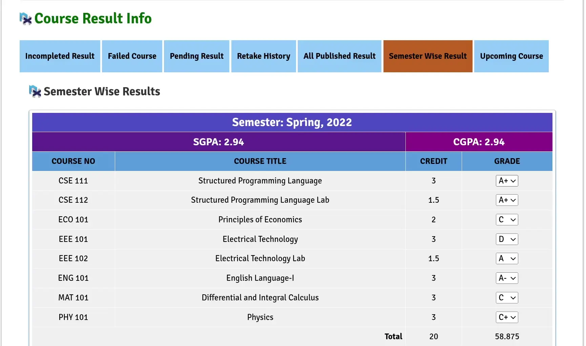

<p align="center">
  </img>
  <h1 align="center">BUBT Grade Calculator</h1>
</p>

### Real-Time Result Calculator for [BUBT Annex](https://annex.bubt.edu.bd)

This simple extension allows you to see instant GPA updates as you tweak course grades!

## 🌐 Tested Browsers:

- Chromium forks
- Firefox forks

## 🎥 Extension in Action:

<p align="center">

</p>

## 🧠 Calculation Logic

- Grade points and calculations are taken from [BUBT's official website](https://www.bubt.edu.bd/Home/page_details/Evaluation_Grading_System)

- Courses with unpublished result are omitted from calculation (indicated by grade `-`)

- Best grade of each courses are used for calculation (retakes / improvements)

- Result of retake course is only included in the semester they were mainly in.

#### Some examples:

- A student fails a course in Semester 2 but passes it in Semester 3, the passing grade will be applied to Semester 2's GPA calculation (not Semester 3)"

- A student got **D** in a course in Semester 2 but got **A** in Semester 3, then the best grade **A** will be applied to Semester 2's GPA calculation (not Semester 3)

## ⚡ Installation

### Firefox / Forks

1. Visit the [Official Firefox Add-ons Store](https://addons.mozilla.org/en-US/firefox/addon/bubt-grade-calculator/)
2. Click "Add to Firefox"
3. Done!

### Chromium / Forks

1. Head over to [releases](https://github.com/kurtnettle/bubt-grade-calc/releases/latest) and download the `bubt-grade-calc-x.x.signed.crx` file.
2. On your browser, goto `chrome://extensions`
3. Enable Developer Mode (toggle in top-right or center-right for Edge)
4. Drag N Drop the crx file into the extension page.
5. Confirm installation when prompted.
6. Enjoy!

> [!TIP]
> **Why Different Methods?**
>
> 1. Firefox extensions can be published openly on [AMO](https://addons.mozilla.org) for free 🥳
> 2. Chrome requires paid developer accounts ($5 one-time fee) 🤑

## 💻 Development

**⚠️ The build system currently only supports Linux environments.**

### Prerequisites

Before you begin, ensure you have the followings:

- **Runtime**:
  1. [pnpm](https://pnpm.io/installation) (v10.13.1+)
  2. [Node.js](https://nodejs.org/) (v22.14.0 LTS+)

- **Signing**:
  1. A keypair for CRX signing. I used [this tool](https://itero.plasmo.com/tools/generate-keypairs) from plasmo.
  2. Add the generated **public key** to the `key` field in [chrome-manifest.json](./manifest/chrome-manifest.json)

### Build Process

1. Clone the repository:
   ```bash
   git clone https://github.com/kurtnettle/bubt-grade-calc.git
   ```
2. Enter the directory:
   ```bash
   cd bubt-grade-calc
   ```
3. Install the dependencies
   ```bash
   pnpm i
   ```
4. Make your changes to the source code. 💫

5. Build the extensions:
   ```bash
   chmod +x build.sh
   ./build.sh
   ```
   This will generate a `.xpi` and `.crx` file inside the `dist/` directory.

> [!IMPORTANT]
> **Chromium CRX**
>
> If you want auto-update then don't forget to fill the `update_url` field in the [chrome-manifest.json](./manifest/chrome-manifest.json)

### ❓ Why this extension?

So at 02:50AM on 13th July before going to bed, I was wondering how I could boost my CGPA to at least 3.0. So I started calculating my grades manually but after finishing 1st semester I got tired. Then I made a simple python script to automatically calculate the SGPA and CGPA. Still I wasn't satisfied. I was looking for something in realtime as I need to know what grade of which course can impact my result the most.

Most of the websites on internet requires you to put the grades manually (Who the heck even does that tedious work? at least not me!)
That’s when I decided to create a web extension, which solved my problem efficiently.

**Note to future me:** I initially wanted to build a website but that's just reinventing the wheel (Bro, you still need to type the grades and points manually -\_-)
Then I thought of making an extension which will pass the HTML of Annex result webpage to my website. Also it took a bit of time due the confusion with the calculation. (like handling the retake courses, what to do with what -,-)

`> Install browser extension`

`> work on another website`

Nah, thats not user-friendly at all! So I ended up building a browser extension -,-

## 🤝 Contributing

Contributions are welcome! If you'd like to improve the tool or fix bugs, feel free to submit a pull request. Please ensure your changes align with the project's coding standards and include appropriate tests.

## 📜 Attributions

Extension icon is from [FlatIcon](https://www.flaticon.com)

## 🙌 Acknowledgments

I am grateful to these amazing open-source projects:

- [Pnpm](https://pnpm.io/) - Fast, disk space efficient package manager
- [Rollup](https://rollupjs.org/) - JS module bundler
- [web-ext](https://github.com/mozilla/web-ext) - Firefox extension tooling
- [XO](https://github.com/xojs/xo) - ESLint wrapper with great defaults
- [@types/chrome](https://github.com/DefinitelyTyped/DefinitelyTyped/tree/master/types/chrome) - Chrome extension type definitions
- [@types/firefox-webext-browser](https://github.com/DefinitelyTyped/DefinitelyTyped/tree/master/types/firefox-webext-browser) - Firefox-webext-browser type definitions

_And all their maintainers and contributors!_

## 📜 License

This project is licensed under the GPLv3 License. See the [LICENSE](./LICENSE) file for full details.

By contributing to this project, you agree that your contributions will be licensed under the GPLv3 License as well.
